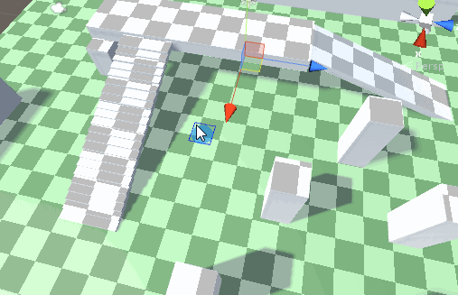
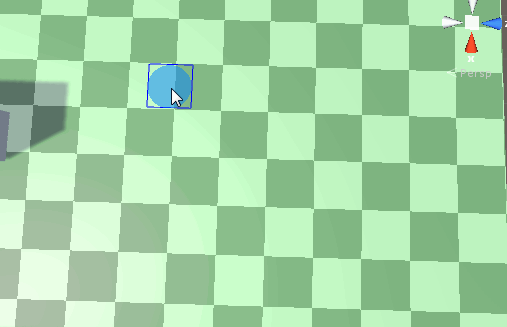
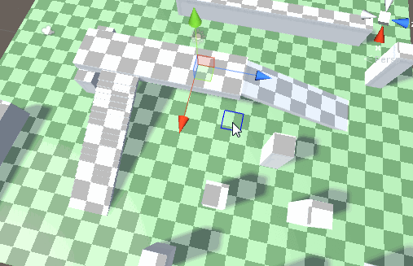
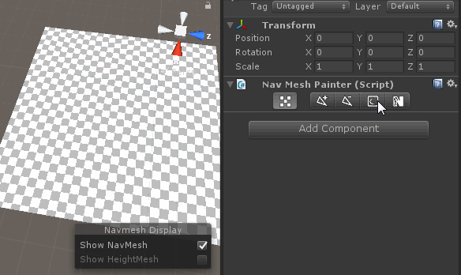

# NavMeshPainter

### 说明:

提供一种允许直接在不规则表面绘制mesh并烘焙为NavMesh的编辑器工具，目前处于测试阶段并将不定期更新维护。

实现方式主要为获取需要绘制的三角面，按照指定深度递归，并获得实际待绘制的三角形，最后向上合并三角形节点，因此绘制精度将取决于初始化工具时设置的精度。

此外由于烘焙功能本身仍然基于Unity3D的NavMesh烘焙系统，因此仍然需要依赖Navigation相关设置

暂时支持如下主要功能：

#### 1.允许使用圆形和矩形笔刷任意绘制和擦除路径：

#### 2.支持画线工具和绘制立方体/球体/圆柱体填充区域

#### 4.支持从贴图创建路径

ps.该功能需要依赖目标mesh的uv

备注：暂不支持Terrain地形上绘制自定义NavMesh，未来会进行添加。
     Agent Radius设置较小时可能出现烘焙出的NavMesh顶点数过多的问题，目前正在优化。

另外工具在Unity5.6.3上开发，但实际上基本没有使用到版本相关的API，较低版本打开应该只会报NavMesh相关API的错误，可以直接进行修改。未来会增加低版本兼容。

